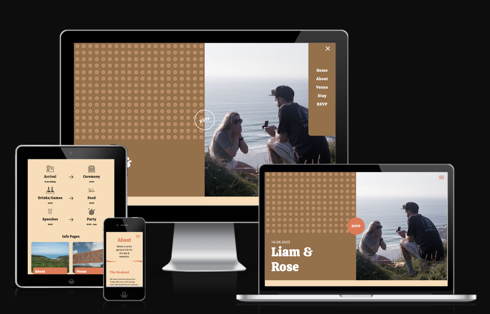

# Wedding Site (Liam & Rose)



## Overview

A bespoke WordPress theme built to contain all the information a wedding guest would require as well as a form used to collect guest RSVP's. The purpose for this theme came about form personal experience when attending a wedding and needing to easily find out useful information. Using an online form alongside MailChimp to send out e-invites was done for environmental reasons.

## Table of contents

### 1. [Technical Overview](#technical-overview)

### 2. [Design](#design)

-   Typography
-   Colours
-   Icons/Illustrations
-   Logo

### 3. [WordPress](#wordpress)

### 4. [Features and Improvements](#features-and-improvements)

### 5. [Technologies Used](#technologies-used)

---

### Technical Overview

This theme has been built with the idea of it being completely content managed by utilising [Advanced Custom Fields](https://www.advancedcustomfields.com/). However, since this was also a personal project I was keeping costs at a minimum meaning I did not purchase the paid version of ACF. Due to this, the feature that would allow this theme to be completely content managed [Flexible Layouts](https://www.advancedcustomfields.com/resources/building-layouts-with-the-flexible-content-field-in-a-theme/) was not available. Nevertheless, it would be very simple to purchase this plugin, make some minor changes to remove the current content constraints in the code base to make the theme 100% content managed.

---

### Design

**Typography**

-   Heading - Calistoga

    -   Calistoga is a cheerful, space saving display typeface. It was inspired by Oscar M. Bryn's lettering as seen on the posters made for the Western US based Santa Fe Railroad. Its vintage railroad flavor is found in the whole design.

-   Body - Open Sans

    -   Open Sans is a humanist sans serif typeface designed by Steve Matteson, Type Director of Ascender Corp. Open Sans was designed with an upright stress, open forms and a neutral, yet friendly appearance.

**Colours**

The oranges and browns were used to create and work with the retro 70's style this WP theme has.

[Colour Palette](https://colorswall.com/palette/88808)

-   Background colour - #fcdcb4
-   Primary - #9a6e44
-   Secondary - #ec744e
-   Yellow - #e2b944

**Icons/Illustrations**

-   All PNG icons for this site were downloaded from [The Noun Project](https://thenounproject.com/) with credits given to the artist in the `title` attribute. These icons mainly feature in `/wp-content/themes/wedding-site/template-parts/timeline.php` which is located on the landing page.

-   There are a few instances of SVG's throughout the theme. Some of these are included via CSS by converting the SVG code into a data URL. However, I would like to add SVG's using a sprite map which I will build into the theme at a later point.

**SVG Resources**

-   Before using any SVG I will always run it through this neat tool created by [Jake Archibold](https://jakearchibald.github.io/svgomg/) which removes unnecessary code.

-   Confetti SVG. Loads on the RSVP page once the form submits successfully - https://codepen.io/lilianqian/pen/OxzeyZ

-   Landing page hero pattern - https://heropatterns.com/

**Logo/Favicon**

-   This was created very simply by using the Calistoga title font and typing the first letter of the Bride and Grooms first name using the themes colours.


---

### WordPress

#### Development

This site was developed using [Local by Flywheel](https://localwp.com/).

-   PHP 8.0
-   Server NGINX
-   Database MySQL 8.0.16

It was then deployed using Local to their WordPress hosting platform [Flywheel](https://getflywheel.com/).

At the time of writing (and as the live site is retired) here are the current WP core and plugin versions.

Whenever I build a WP theme I always want to keep the plugin requirement to a minimum. This theme uses the following plugins.

-   [Advanced Custom Fields](https://www.advancedcustomfields.com/) - Content editing tool

-   [Akismet Anti-Spam: Spam Protection](https://akismet.com/) - Spam & Bot protection

-   [Classic Editor](https://wordpress.org/plugins/classic-editor/) - Restores the classic WordPress editor options.

-   [Contact Form 7](https://contactform7.com/) - Form builder plugin

-   [Imagify](https://imagify.io/) - Image compression tool

-   [WP Mail SMTP](https://wordpress.org/plugins/wp-mail-smtp/) - Email deliverability

-   [Yoast SEO](https://yoast.com/) - SEO tool

---

### Features and Improvements

#### Features

-   100% successful email deliverability using Contact Form 7, WP SMTP Plugin and Gmail. Resource for setting this up https://www.youtube.com/watch?v=qlWrvNn85kY&ab_channel=WPBeginner-WordPressTutorials

-   A custom, handy function for displaying images and making use of default WordPress image functions

```
    function wedd_render_wp_image($id, $size) {
        // Get all image data
        $src_data = wp_get_attachment_image_src($id, $size, false);
        $srcset = wp_get_attachment_image_srcset($id, $size);
        $alt = get_post_meta($id, '_wp_attachment_image_alt', true);
        $caption = wp_get_attachment_caption($id);

        // Output image html
        return '
            
        ';
    }
```

-   Form error/success handling

#### Improvements (To build)

-   Build an image Lazyloading system using JavaScripts `IntersectionObserver`

-   Add in a more robust fluid typography solution

-   Improve the confetti SVG placement. Currently this is done positioned using `transform` which requires far too many `media queries`

---

### Technologies Used

#### Syntax

-   HTML

-   PHP

-   [SASS](https://sass-lang.com/)

-   Javascript

#### Compiler

-   To compile SASS code into CSS the built in `sass --watch` compiler was used. This works by pointing the `app.scss` file to `main.css`
